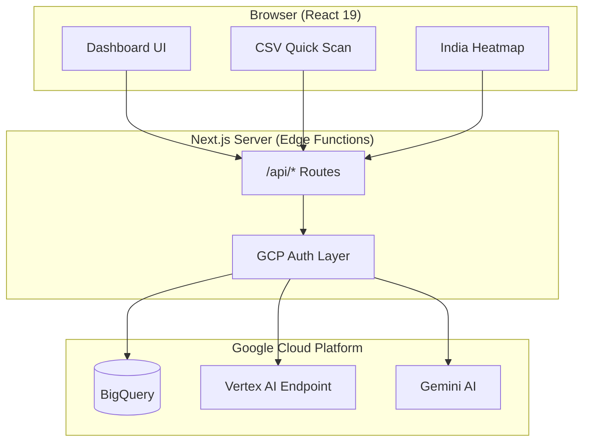
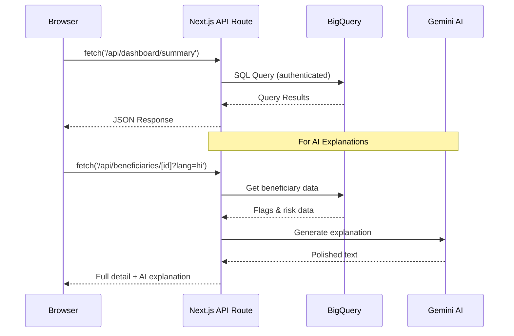

# JanAvlokan - Technical Architecture Review

> **Hackathon-Ready Deep Dive** | Last Updated: February 3, 2026

---

## 🏗️ Executive Summary

**JanAvlokan** is a **serverless, cloud-native fraud detection platform** built with Next.js 16, leveraging Google Cloud Platform (BigQuery, Vertex AI, Gemini) for backend processing. The architecture eliminates the need for a traditional backend server by using Next.js API Routes as the API layer.

---

## 1. Why Next.js? (Architecture Decision)

### The "No Backend" Strategy



### Why This Works for a Hackathon

| Benefit | Technical Rationale |
|---------|---------------------|
| **Rapid Development** | Single codebase for frontend + API, no server management |
| **Serverless Scaling** | Next.js API routes scale automatically on Vercel/GCP |
| **Type Safety** | Full TypeScript from UI to database queries |
| **Cost Efficiency** | Pay-per-request with GCP, no idle server costs |
| **Security** | API keys stay server-side, never exposed to browser |

### Key File: [next.config.ts](file:///c:/janavlokan/next.config.ts)
```typescript
// Minimal config - Next.js handles everything
const nextConfig: NextConfig = {};
```

---

## 2. Backend Architecture: Next.js API Routes

### How API Calls Work

The "backend" is a collection of **11 API route directories** under `src/app/api/`:

```
src/app/api/
├── alerts/email/          # Email alert triggers
├── analytics/             # Time-series analysis
├── audit/                 # Audit logs & export
├── batch/refresh/         # Batch data refresh
├── beneficiaries/         # LPG beneficiary data
├── dashboard/             # Summary & distribution
├── geo/district-risk/     # Geographic heatmap data
├── predict/quick-scan/    # Vertex AI predictions
├── investigations/        # Case investigations
├── mdm/                   # Mid-Day Meal scheme APIs
└── data/                  # Raw data access
```

### Example: Dashboard Summary API

**File:** [src/app/api/dashboard/summary/route.ts](file:///c:/janavlokan/src/app/api/dashboard/summary/route.ts)

```typescript
// 1. Import singleton BigQuery client
import { getBigQueryClient, DashboardSummary } from '@/lib/bigquery';

export async function GET() {
  // 2. Get authenticated client
  const bigquery = getBigQueryClient();
  
  // 3. Execute SQL query
  const query = `
    SELECT
      COUNT(*) AS total_beneficiaries,
      COUNTIF(risk_level = 'HIGH') AS high_risk,
      COUNTIF(risk_level = 'MEDIUM') AS medium_risk,
      COUNTIF(risk_level = 'LOW') AS low_risk
    FROM \`gfg-fot.lpg_fraud_detection.fraud_with_explanations\`
  `;
  
  const [job] = await bigquery.createQueryJob({ query });
  const [rows] = await job.getQueryResults();
  
  // 4. Return typed response
  return NextResponse.json(result);
}
```

### Data Flow Pattern



---

## 3. Database Layer: BigQuery Integration

### Singleton Pattern

**File:** [src/lib/bigquery.ts](file:///c:/janavlokan/src/lib/bigquery.ts)

```typescript
let bigqueryClient: BigQuery | null = null;

export function getBigQueryClient(): BigQuery {
  if (!bigqueryClient) {
    const projectId = process.env.GOOGLE_PROJECT_ID;
    
    // Supports 3 auth methods:
    // 1. Key file (GOOGLE_APPLICATION_CREDENTIALS)
    // 2. Inline credentials (GOOGLE_CLIENT_EMAIL + GOOGLE_PRIVATE_KEY)
    // 3. Fallback to gcp-key.json
    
    bigqueryClient = new BigQuery({ projectId, ... });
  }
  return bigqueryClient;
}
```

### TypeScript Interfaces for Data

```typescript
// LPG Scheme Types
export interface HighRiskBeneficiary {
  beneficiary_id: string;
  risk_level: string;           // 'HIGH' | 'MEDIUM' | 'LOW'
  mean_squared_error: number;   // ML anomaly score
  flag_high_recent_activity: boolean;
  flag_multiple_dealers: boolean;
  flag_cross_district: boolean;
  flag_high_lifetime_usage: boolean;
}

// MDM Scheme Types
export interface MDMHighRiskSchool {
  school_id: number;
  school_name: string;
  district: string;
  risk_level: string;
  anomaly_score: number;
  flag_ghost_meals: boolean;
  flag_ingredient_inflation: boolean;
  flag_fund_overclaim: boolean;
  flag_cook_anomaly: boolean;
}
```

### Why BigQuery?

1. **Scale**: Handles 100M+ transactions without infrastructure management
2. **Cost**: Only pay for queries run (great for hackathon budget)
3. **BigQuery ML**: Models trained directly in the database
4. **SQL Interface**: No ORM complexity, direct SQL

---

## 4. AI/ML Layer

### Three AI Components

| Component | Purpose | Integration |
|-----------|---------|-------------|
| **BigQuery ML** | Batch anomaly detection | Pre-computed risk scores stored in `fraud_with_explanations` table |
| **Vertex AI** | Real-time predictions | Called for CSV Quick Scan feature |
| **Gemini AI** | Human-readable explanations | Polishes flag-based reasons into natural language |

### Vertex AI Prediction Flow

**File:** [src/app/api/predict/quick-scan/route.ts](file:///c:/janavlokan/src/app/api/predict/quick-scan/route.ts)

```typescript
// 1. Get OAuth2 token
const auth = new GoogleAuth({
  credentials: {
    client_email: process.env.GOOGLE_CLIENT_EMAIL,
    private_key: process.env.GOOGLE_PRIVATE_KEY,
  },
  scopes: ['https://www.googleapis.com/auth/cloud-platform'],
});

// 2. Call Vertex AI endpoint
const response = await fetch(VERTEX_AI_URL, {
  method: 'POST',
  headers: {
    'Authorization': `Bearer ${accessToken}`,
    'Content-Type': 'application/json',
  },
  body: JSON.stringify({ instances: validRecords }),
});

// 3. Fallback to rule-based detection if Vertex AI fails
if (!accessToken) {
  return runRuleBasedDetection(validRecords);
}
```

### Rule-Based Fallback

```typescript
function runRuleBasedDetection(records) {
  return records.map((record) => {
    let riskScore = 0;
    const flags = [];
    
    // Deterministic rules
    if (record.total_cylinders_30d > 4) {
      flags.push('high_recent_activity');
      riskScore += 0.3;
    }
    if (record.unique_dealers_30d > 2) {
      flags.push('multiple_dealers');
      riskScore += 0.25;
    }
    // ...more rules...
    
    const risk_level = riskScore >= 0.5 ? 'HIGH' 
                      : riskScore >= 0.25 ? 'MEDIUM' 
                      : 'LOW';
    
    return { beneficiary_id, risk_level, risk_score, flags };
  });
}
```

### Gemini AI for Explanations

**File:** [src/lib/gemini.ts](file:///c:/janavlokan/src/lib/gemini.ts)

```typescript
// CRITICAL DESIGN: Gemini is ONLY a language polisher, NOT a decision maker
// All fraud flags come from deterministic BigQuery rules

export async function generateGeminiExplanation(
  riskLevel: string,
  reasonCodes: string[],
  language: SupportedLanguage = 'en'
): Promise<string> {
  // 1. Sanitize inputs (prevent prompt injection)
  const safeRiskLevel = sanitizeRiskLevel(riskLevel);
  const safeReasonCodes = sanitizeReasonCodes(reasonCodes);
  
  // 2. Strict prompt with guardrails
  const prompt = `You are generating explanations for a government audit dashboard.

Rules:
- Do NOT add new reasons
- Do NOT infer intent or fraud
- Do NOT use words like "suspicious", "fraud", "illegal"
- Use neutral, administrative language

Risk Level: ${safeRiskLevel}
Reasons: ${safeReasonCodes.join(', ')}
Output Language: ${language}

Generate a brief explanation (2-3 sentences max).`;

  // 3. Post-generation safety filter
  const blockedWords = ['fraud', 'suspicious', 'criminal', 'illegal'];
  if (blockedWords.some(word => explanation.includes(word))) {
    return getStaticExplanations(safeReasonCodes, language).join('\n');
  }
}
```

---

## 5. Frontend Data Fetching Pattern

### Dashboard Page Data Flow

**File:** [src/app/dashboard/page.tsx](file:///c:/janavlokan/src/app/dashboard/page.tsx)

```typescript
// 1. Global State Management
const { currentScheme, schemeConfig } = useScheme();

// 2. Parallel Data Fetching
useEffect(() => {
  async function fetchDashboardData() {
    const [summaryRes, distributionRes, entitiesRes] = await Promise.all([
      fetch(`${apiBase}/dashboard/summary`),
      fetch(`${apiBase}/dashboard/distribution`),
      fetch(`${apiBase}/beneficiaries/high-risk?limit=50`),
    ]);
    // ...process responses...
  }
  
  fetchDashboardData();
}, [refreshKey, currentScheme]);

// 3. Dynamic API Base
const getApiBase = () => currentScheme === 'MDM' ? '/api/mdm' : '/api';
```

### Multi-Scheme Context

**File:** [src/context/SchemeContext.tsx](file:///c:/janavlokan/src/context/SchemeContext.tsx)

```typescript
const schemeConfigs = {
  LPG: {
    name: 'LPG',
    entityName: 'Beneficiary',
    apiBase: '/api',
    color: '#3b82f6',
  },
  MDM: {
    name: 'MDM',
    entityName: 'School',
    apiBase: '/api/mdm',
    color: '#22c55e',
  },
};

// Persisted to localStorage
const [currentScheme, setCurrentScheme] = useState<SchemeType>('LPG');
```

---

## 6. Key UI Components

### CSV Quick Scan

**File:** [src/components/CSVQuickScan.tsx](file:///c:/janavlokan/src/components/CSVQuickScan.tsx)

- **Drag-and-drop** file upload with visual feedback
- **Client-side CSV parsing** (no server upload)
- **API call** to `/api/predict/quick-scan`
- **Real-time results** display with risk badges

```typescript
const parseCSV = (text: string) => {
  const lines = text.trim().split('\n');
  const headers = lines[0].split(',').map(h => h.trim().toLowerCase());
  return lines.slice(1).map(line => {
    // ...parse each row...
  });
};

const processFile = async (file: File) => {
  const text = await file.text();
  const records = parseCSV(text);
  
  const response = await fetch('/api/predict/quick-scan', {
    method: 'POST',
    body: JSON.stringify({ records }),
  });
};
```

### India Heatmap

**File:** [src/components/IndiaMap.tsx](file:///c:/janavlokan/src/components/IndiaMap.tsx)

- **Leaflet.js** for interactive maps
- **Dynamic import** to avoid SSR issues
- **88 district coordinates** pre-mapped
- **Color-coded risk zones** (Critical → Minimal)

```typescript
const MapContainer = dynamic(
  () => import("react-leaflet").then((mod) => mod.MapContainer),
  { ssr: false }  // Critical: Leaflet doesn't work with SSR
);

// Risk color mapping
function getRiskColor(count: number, maxCount: number): string {
  const ratio = count / maxCount;
  if (ratio > 0.7) return "#ef4444"; // Red - Critical
  if (ratio > 0.5) return "#f97316"; // Orange - High
  if (ratio > 0.3) return "#eab308"; // Yellow - Medium
  return "#22c55e";                   // Green - Low
}
```

---

## 7. Security Considerations

### API Key Protection

| Layer | Protection |
|-------|------------|
| **Environment Variables** | API keys in `.env.local`, never in code |
| **Server-Side Only** | Keys accessed only in API routes |
| **Header Authentication** | Gemini key sent via `x-goog-api-key` header, not URL |
| **Prompt Injection Prevention** | Allowlist validation for all user inputs |

### Prompt Injection Prevention

```typescript
const ALLOWED_RISK_LEVELS = ['HIGH', 'MEDIUM', 'LOW'];
const ALLOWED_REASON_CODES = [
  'high_recent_activity',
  'multiple_dealers',
  'cross_district',
  'high_lifetime_usage',
  'normal',
];

function sanitizeReasonCodes(reasonCodes: string[]): string[] {
  return reasonCodes
    .map(code => code?.toLowerCase()?.trim()?.replace(/[\x00-\x1f\x7f]/g, ''))
    .filter(code => ALLOWED_REASON_CODES.includes(code));
}
```

---

## 8. Hackathon Q&A Cheat Sheet

### "Why not use a traditional backend?"
> Next.js API Routes are **serverless functions** that scale automatically. For a hackathon, this means zero DevOps overhead while still having full backend capabilities.

### "How does the ML model work?"
> We use **BigQuery ML** for batch predictions (stored in `fraud_with_explanations` table) and **Vertex AI** for real-time predictions (CSV Quick Scan). The model uses **unsupervised anomaly detection** (autoencoder) trained on behavioral features.

### "How do you handle privacy?"
> All PII is **hashed irreversibly** before storage. Location data is **aggregated to district level**. The system is **advisory only** - no subsidies are blocked, only flagged for human review.

### "What happens if Vertex AI fails?"
> We have a **rule-based fallback** that uses deterministic thresholds (e.g., >4 cylinders in 30 days = high recent activity flag). This ensures the system always works.

### "How do you prevent AI hallucinations?"
> Gemini is **strictly a language polisher**. All fraud flags come from deterministic BigQuery rules. We also use:
> - Allowlist validation for inputs
> - Blocked word filtering for outputs
> - Static fallback if AI generates inappropriate content

### "What's the tech stack?"
> - **Frontend:** Next.js 16, React 19, TypeScript, Tailwind CSS
> - **Visualization:** Recharts (charts), Leaflet (maps)
> - **Backend:** Next.js API Routes (serverless)
> - **Database:** Google BigQuery
> - **AI/ML:** BigQuery ML, Vertex AI, Gemini 2.0 Flash

---

## 9. Key Files Reference

| File | Purpose |
|------|---------|
| [src/lib/bigquery.ts](file:///c:/janavlokan/src/lib/bigquery.ts) | BigQuery client + TypeScript interfaces |
| [src/lib/gemini.ts](file:///c:/janavlokan/src/lib/gemini.ts) | Gemini AI integration with safety guards |
| [src/context/SchemeContext.tsx](file:///c:/janavlokan/src/context/SchemeContext.tsx) | Multi-scheme state management |
| [src/app/dashboard/page.tsx](file:///c:/janavlokan/src/app/dashboard/page.tsx) | Main dashboard (1035 lines) |
| [src/components/CSVQuickScan.tsx](file:///c:/janavlokan/src/components/CSVQuickScan.tsx) | Real-time fraud detection UI |
| [src/components/IndiaMap.tsx](file:///c:/janavlokan/src/components/IndiaMap.tsx) | Geographic risk visualization |
| [src/app/api/predict/quick-scan/route.ts](file:///c:/janavlokan/src/app/api/predict/quick-scan/route.ts) | Vertex AI prediction endpoint |
| [src/app/api/dashboard/summary/route.ts](file:///c:/janavlokan/src/app/api/dashboard/summary/route.ts) | Dashboard KPI data |

---

*Generated for hackathon presentation preparation*
